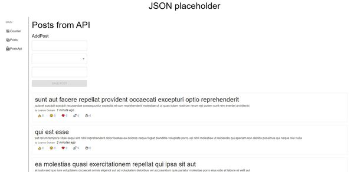
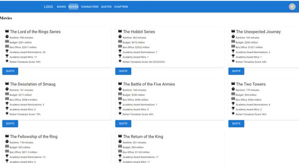
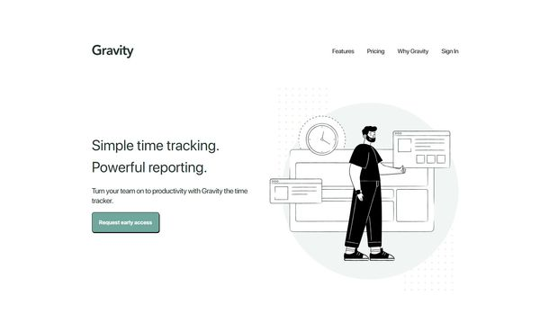
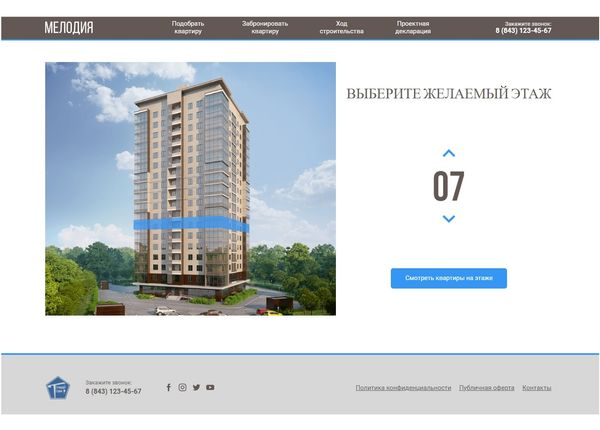

<div align='center'><h1>theCapnCoder</h1></div>

<table>
  <thead>
    <tr>
      <th>Repository</th>
      <th>Site</th>
      <th>Technologies used</th>
      <th>Description</th>
    </tr>
  <tbody>
    <tr>
      <td><a href='https://github.com/theCapnCoder/Mitla'>Mitla</a></td>
      <td><a href='https://thecapncoder.github.io/Mitla/'>Link</a></td>
      <td>TS MaterialUI React SCSS HTML</td>
      <td>Pexel Perfect (Only: 1920px)</td>
      <td></td>
    </tr>
    <tr>
      <td><a href='https://github.com/theCapnCoder/energy-rent'>Energy rent</a></td>
      <td><a href='https://thecapncoder.github.io/energy-rent/'>Link</a></td>
      <td>TS MaterialUI Recharts Formik React SCSS HTML</td>
      <td>Get Books, Book, Chapters, Movies, Pagination</td>
      <td></td>
    </tr>
  </tbody>
  <thead>
</table>

<details>
<summary><b>Frozen projects API</b></summary>
<table>
  <thead>
    <tr>
      <th>Repository</th>
      <th>Site</th>
      <th>Technologies used</th>
      <th>Description</th>
    </tr>
  <tbody>
    <tr>
      <td><a href='https://github.com/theCapnCoder/json-placeholder'>Json placeholder</a></td>
      <td><a href='https://thecapncoder.github.io/json-placeholder'>Link</a></td>
      <td>TS MaterialUI Router Axios React SCSS HTML</td>
      <td>Get Books, Book, Chapters, Movies, Pagination</td>
      <td></td>
    </tr>
    <tr>
      <td><a href='https://github.com/theCapnCoder/Promo'>Promo</a></td>
      <td><a href='https://thecapncoder.github.io/Promo/'>Link</a></td>
      <td>TS React SCSS HTML</td>
      <td>PixelPerfect (Adaptive Layout: 320px, 480px, 768px, 1920px)</td>
      <td></td>
    </tr>
    <tr>
      <td><a href='https://github.com/theCapnCoder/API--The-lord-of-the-rings'>The lord of the rings</a></td>
      <td><a href='https://thecapncoder.github.io/API--The-lord-of-the-rings/'>Link</a></td>
      <td>TS MaterialUI Router Axios React SCSS HTML</td>
      <td>Get Books, Book, Chapters, Movies, Pagination</td>
      <td></td>
    </tr>
  </tbody>
  <thead>
</table>
</details>

<details>
<summary><b>Old Projects HTML, CSS</b></summary>
<table>
  <thead>
    <tr>
      <th>Repository</th>
      <th>Site</th>
      <th>Technologies used</th>
      <th>Description</th>
      <th>Prewiev</th>
    </tr>
  <tbody>
    <tr>
      <td><a href='https://github.com/theCapnCoder/Decenter-Ads'>Decenter Ads</a></td>
      <td><a href='https://thecapncoder.github.io/Decenter-Ads/'>Link</a></td>
      <td>TS Formik Yup React SCSS HTML</td>
      <td>PixelPerfect (Adaptive Layout: 1366px, 390px)</td>
      <td></td>
    </tr>
    <tr>
      <td><a href='https://github.com/theCapnCoder/Video-Line'>Video Line</a></td>
      <td><a href='https://thecapncoder.github.io/Video-Line/'>Link</a></td>
      <td>TS Redux React SCSS HTML</td>
      <td>PixelPerfect (Only: 1440px)</td>
      <td></td>
    </tr>
    <tr>
      <td><a href='https://github.com/theCapnCoder/gravity'>Gravity</a></td>
      <td><a href='https://thecapncoder.github.io/gravity/'>Link</a></td>
      <td>TS React Tailwind CSS HTML</td>
      <td>PixelPerfect (Adaptive Layout: 1440px, 375px)</td>
      <td></td>
    </tr>
    <tr>
      <td><a href='https://github.com/theCapnCoder/GK_Melody'>GK Melody</a></td>
      <td><a href='https://thecapncoder.github.io/GK_Melody/'>Link</a></td>
      <td>Tailwind CSS HTML</td>
      <td>PixelPerfect</td>
      <td></td>
    </tr>
    <tr>
      <td><a href='https://github.com/theCapnCoder/Amazing_mountain'>Amazing mountain</a></td>
      <td><a href='https://thecapncoder.github.io/Amazing_mountain/'>Link</a></td>
      <td>Tailwind CSS HTML</td>
      <td>PixelPerfect</td>
      <td></td>
    </tr>
    <tr>
      <td><a href='https://github.com/theCapnCoder/N-pay'>N-pay</a></td>
      <td><a href='https://thecapncoder.github.io/N-pay/'>Link</a></td>
      <td>Tailwind CSS HTML</td>
      <td>PixelPerfect</td>
      <td></td>
    </tr>
  </tbody>
  <thead>
</table>
</details>

<!-- -  `#f03c15`
-  `#c5f015`
-  `#1589F0`


****

### H1 text

<p align="center">
  <i>inspired by <a href="https://github.com/natemoo-re">Center text</a> for song api</i>
</p>

****

```
block
```

<font color="">Этот текст красного цвета</font>
<font color="green">Этот текст зеленого цвета</font>

<div style="display: inline-block; border-radius: 10px; background-color: rgb(211, 229, 239); padding: 10px;">
 <font color="black">TS</font> 
</div>

**Front**
[Link]()
</br> -->